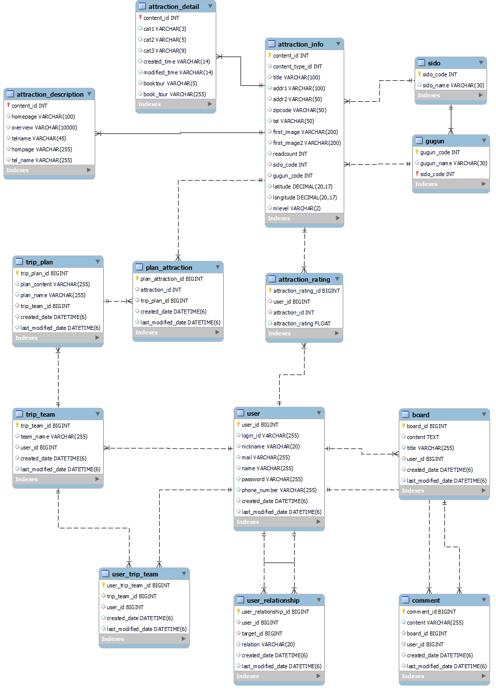

# EnjoyTrip_FrontEnd_서울_11_송다은_오승진

# 팀원 소개

| 팀원   |
| ------ |
| 송다은 |
| 최지원 |

# 1. 기능 구현 목록  

| 순번 | 요구사항명               | 요구사항 상세 |
| :--: | :----------------------: | :-----------: |
|  F01  | 지역별 관광지 정보 수집   |   한국관광공사 : 지역별 관광지 정보를 얻어와 화면에 표시    |
|    F02  |관광지, 숙박, 음식점 조회    |  관광지 정보를 지역별 원하는컨텐츠 별 조회    |
|   F03  | 문화시설, 공연, 여행코스, 쇼핑조회                |   관광지 정보를 지역별 원하는 컨텐츠 별 조회     |
|   F04  | 회원 관리        |    회원가입, 비밀번호 수정, 회원 정보 조회, 탈퇴     |
|  F05  | 로그인 관리   |    로그인 / 로그아웃 / 비밀번호 찾기     |    
|  F06  | 게시판 등록   |    게시판 등록/수정/삭제/조회    | 
|  F07  | 나만의 여행 계획 관리  |    여행 팀 생성, 팀원 초대, 여행 계획 추가/삭제/수정/조회,  |  
|  F08  | 관광지 평점 관리  |   관광지 평점 추가/수정/삭제/조회 |

# 2. E-R Diagram 
 

  
  
# 2. Class Diagram 
